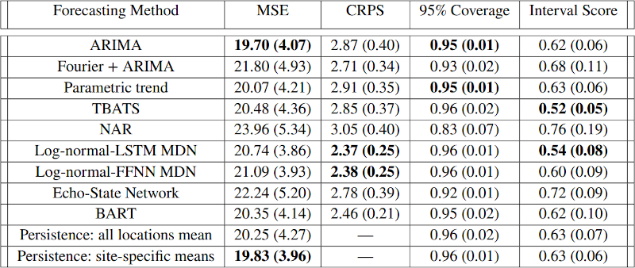
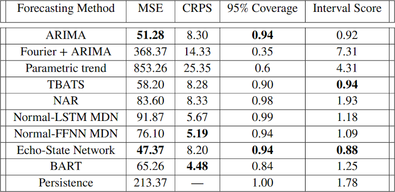

class: inverse

```{r include=FALSE}
library(ggplot2)
filter <- dplyr::filter
knitr::opts_chunk$set(warning=FALSE, message=FALSE, fig.width=10.5, fig.height=4, 
  comment=NA, rows.print=16)
theme_set(theme_gray(base_size = 24))
```

## What are Statisticians Good For?

We **quantify uncertainty** for the advancement of science. 

---

class: inverse

## Machine Learning: The Enemy?

The explosion of machine learning and artificial intelligence over the last 30 years, concurrent with the growth in CPU and GPU power to allow for such models to be readily accessible to the average scientist, has resulted in a sea change in statistical studies of the **environment**.

--

<br/>
While technically these models are parametric .. in practice ... opaque, black-box methods!

--

<br/>
And uncertainty? Never heard of her!

---

class: inverse

## Case Studies for Time Series Forecasting

This issue (of quantifying uncertainty for machine learning models) is
an open area of research. 

<br/>

Our collaborative working group examined the problem of quantifying uncertainty
in a particular environmental modeling problem - this was a 
TIES working group, after all!

---

class: inverse

## Data used for Case Studies

We focused on two example case studies: ambient particulate matter daily
concentrations (from Toronto!); and hourly temperature and wind from a local
weather station (South Bend, Indiana). 

--

<br/>
* the PM2.5 data consisted of 10 years (3,652 days) of daily measurements from 12 stations
* the temperature and wind data consisted of 1.5 years (12,720 hours) of hourly measurements across 2020 and 2021


---

class: inverse

## Methods

We considered a wide range of models, broadly classified as:

<br/>

* classic statistical approaches: ARIMA; Fourier+ARIMA; Prophet; and TBATS
* machine learning approaches: neural network AR (NNAR); mixture density networks (MDN) - two variants considered; echo-state networks (ESN); and Bayesian adaptive regression tress (BART)
* persistence model - an 'oldie but still a goodie'

---

class: inverse

## Uncertainty

In the classic statistical methods, the uncertainty is largely characterized by
the distribution (or assumed distribution) derived from the model. For example,
ARIMA is well understood, and has calibrated uncertainty under the assumption of
Gaussianity in the residuals from the model fit. 

--

<br />
The question comes: how do we approach this problem in the world of black-box methods?

---

class: inverse

## Uncertainty for Machine Learning Models

* NNAR: Monte Carlo dropout on the nodes of the hidden layers
* MDN: use output mixture components and estimate parametrically
* ESN: ensemble of forecasts; and calibrated uncertainty (Bonas and Castruccio, 2023)
* BART: posterior credible intervals using MCMC

---

class: inverse

## So How Did We Quantify Performance?

Given the training data of 9 years of data for PM2.5, we predict 10-days-ahead 
for the 10th year (355 predictions). Given the training data of 10,308 hours for
temperature and wind, we predict 24-hours ahead and keep only the noon prediction
(100 predictions).

--

<br />
The predictions are then quantified using:

* MSE of prediction
* Continuous Ranked Probability Score (CRPS) - a scoring rule with 0 corresponding to perfect prediction
* 95% prediction interval coverage 
* interval score (Gneiting et al., 2007)

---

class: top

## Particulate Matter Results

<center>

</center>

<br/>
Bold for best result; standard deviation in brackets. 

---

class: top 

## Meteorology Results (Temperature)

<center>

</center>

<br />
Bold for best result.

---

class: inverse

## Key Take-Aways

* proof of concept: uncertainty **can** be estimated for machine learning models in the 
context of environmental modeling

--

* tuning the models to work well first is more important than quantification of uncertainty - if the model does not work well (that is: predict well), who cares what your estimate of
uncertainty is?

--

* once you have built a working (e.g., reasonably high $R^2$ model), there **are** 
options available to explain what it is doing

--

    - computational burden can be very, very high
    
---


class: top, inverse

## Working Group Thoughts

* critical need for early community building

--

* inevitably, some contributors do more

--

* Zoom is sufficient for the 'discussion' part of the collaboration

--

* Zoom is **not** sufficient to replace the heads-together-working-it-out
portion of a collaboration

--

* having someone with more experience and direction is critical

--

* having a really good idea what the desired output is at the start is very important

--

* not a good model for a poorly scoped problem **unless** the team knows each other well already


---

layout: false
class: inverse, middle

<center>
<a href="http://www.trentu.ca/math/"></a> &emsp;&emsp;
<a href="https://creativecommons.org/licenses/by/4.0/"></a>
</center>

## With thanks to all of the collaborators (see our <a href="https://onlinelibrary.wiley.com/doi/10.1002/env.2772">first paper</a>; the second is still under review)

- Contact me: [Email](mailto:wesleyburr@trentu.ca)
- Slides created via the R package [xaringan](https://github.com/yihui/xaringan) by Yihui Xie
- Slides and source at <http://bit.ly/jsm2023>
- Code will be available at GitHub after the paper is accepted

<br/>

This project was done under The International Environmetrics Society's working
group initiative, launched 2021 (and still ongoing!). 